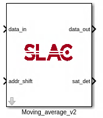

.. _MovingAverage:

===================================
Moving Average
===================================
Introduction
************
This is a reconfigurable moving average filter that users can change the filter length and output data bits format. 

Block interfaces
****************
Inport

On default, input signal is 16 bits signed with 14 decimal bits, output is 32bits signed with 16decimal bits. Number of samples can be varied through shift_addr register, which is an 8 bits unsiged data. So the maximum number of samples to be taken by the filter is 2^8=256. Eg., if you want to take in 128 samples, set shift_addr to 2^7-1, and input 7 to shift_bits under library mask.

Block parameters
****************

Example of referring another page (Make sure you have read intro ":ref:`introduction`" before continuing)

Example of displaying code

.. code-block:: bash

  $ git clone --recursive git@github.com:slaclab/model-composer-dsp-lib
  
  
