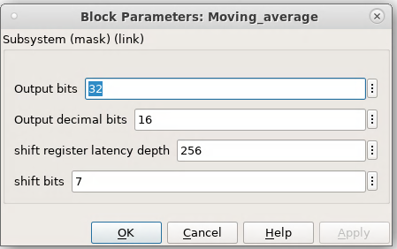

.. _MovingAverage:

===================================
Moving Average
===================================
Introduction
************
This is a reconfigurable moving average filter that users can change the filter length and input/output data bits format. 

.. image:: ../figs/movingaverage.PNG
     :width: 200
     :alt: Alternative text

Block interfaces
****************
Maximum data input and data output bits is 32bits. On default, input signal is 16 bits signed with 14 decimal bits, out data port is 32bits signed with 16decimal bits. 
Filter length can be varied through input port addr_shift which is an 8bits register.

Block parameters
****************

The filter length or the number of samples to be averaged can be varied through shift_addr register, which is an 8 bits unsiged data. So the maximum number of samples to be taken by the filter is 2^8=256. Eg., if you want to average 128 samples, set shift_addr to 2^7-1, and input 7 to shift_bits under library mask.

     
     

#Example of displaying code

#.. code-block:: bash

# $ git clone --recursive git@github.com:slaclab/model-composer-dsp-lib
  
  
