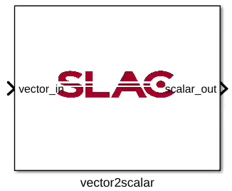

.. _MovingAverage:

===================================
Vector to scalar conversion
===================================
Introduction
************
This block converts a super sample rate (SSR=16) signal to a standard scalar signal. 

Block interfaces
****************

* Input Ports
   * data_in: signed 36_32   
* Output Ports
   * data_out, signed 18_16

     
