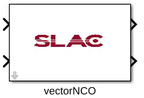

.. _MovingAverage:

===================================
Vector NCO
===================================
Introduction
************
This is a super sample rate numerically controlled oscillator, SSR=16.

Block interfaces
****************
Phase input is unsigned 32 bits integer. There are two orthorgonal outputs, both are signed 18 bits with 16 biary points. A reset input resets the internal counters.

* Input Ports
   * phase_in: unsigned 32bits integer. This is a scalar signal that receives data from software.
   * reset: boolean.
   
* Output Ports
   * real_vector, signed 18bits output with 16 decimal bits. SSR=16.
   * imag_vector, signed 18bits output with 16 decimal bits. SSR=16.
      
Block parameters
****************

The internal counters are all 32bits. M bits=32. Don't change this number.
     
