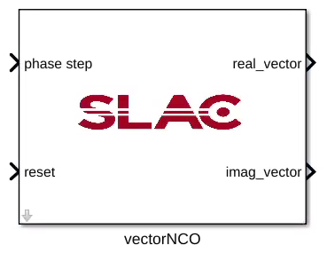
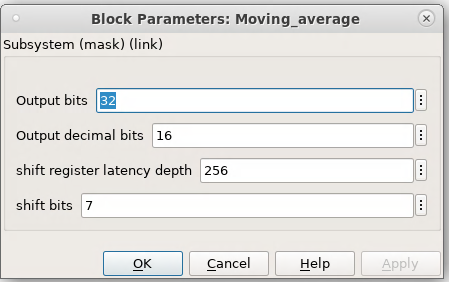

.. _MovingAverage:

===================================
Vector NCO
===================================
Introduction
************
This is a super sample rate numerically controlled oscillator, SSR=16.

Block interfaces
****************
Maximum data input and data output bits is 32bits. On default, input signal is 16 bits signed with 14 decimal bits, out data port is 32bits signed with 16decimal bits. 
Filter length can be varied through input port addr_shift which is an 8bits register.

* Input Ports
   * data_in: 16bits input signal
   * addr_shift: 8 bits input that define the fliter length.
   
* Output Ports
   * data_out, signed 32bits output with 16 decimal bits
   * sat_det, one bit boolean output indicates internal saturation event.
      
Block parameters
****************

The filter length or the number of samples to be averaged can be varied through shift_addr register, which is an 8 bits unsiged data. So the maximum number of samples to be taken by the filter is 2^8=256. Eg., if you want to average 128 samples, set shift_addr to 2^7-1, and input 7 to shift_bits under library mask.

     
